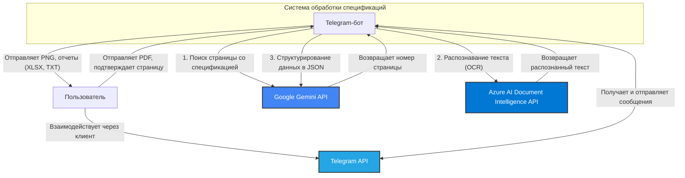
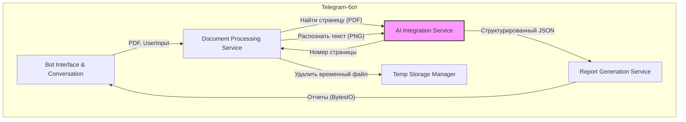
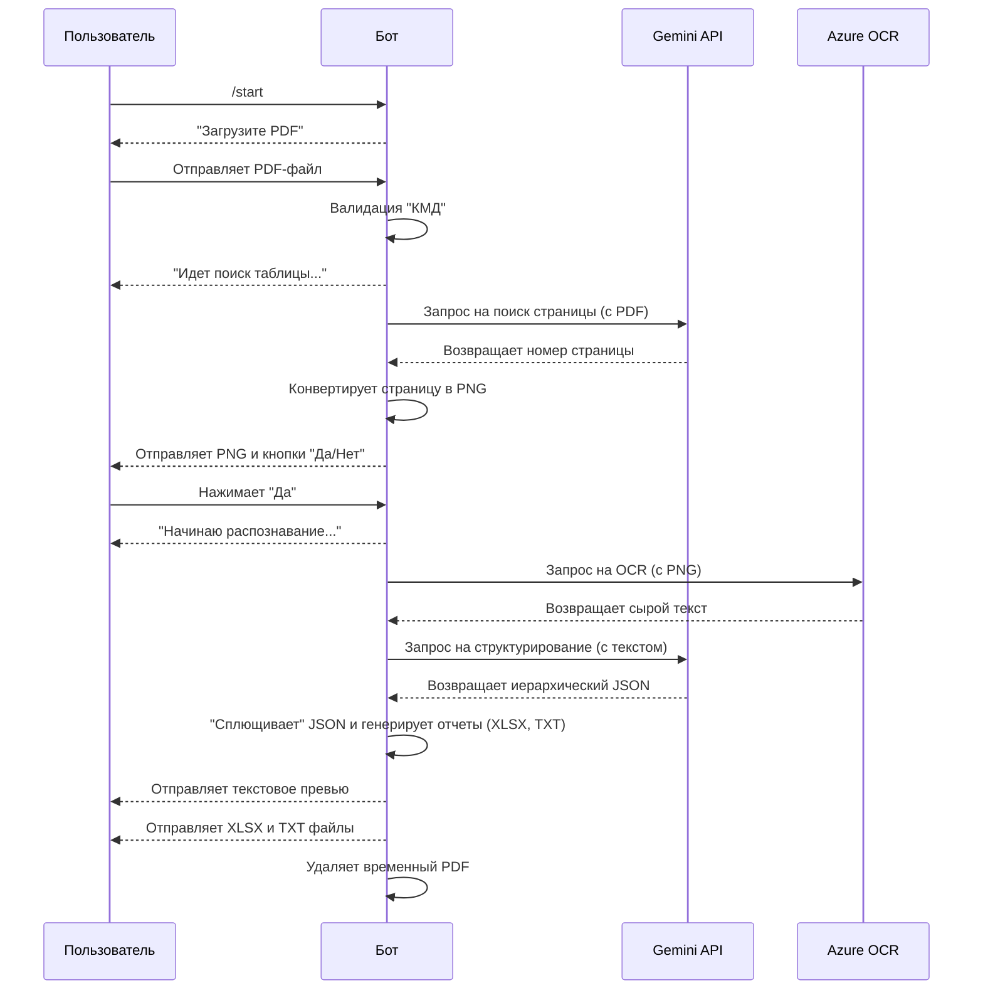

# Архитектурный документ: Telegram-бот для обработки спецификаций

**Версия:** 1.0
**Дата:** 29.07.2025
**Автор:** Уинстон, Архитектор

---

## 1. Введение

### 1.1. Цель документа
Этот документ описывает архитектуру системы для Telegram-бота, предназначенного для автоматической обработки PDF-спецификаций металлопроката. Архитектура спроектирована на основе требований, изложенных в **Product Requirements Document (PRD) v1.1**.

### 1.2. Архитектурные принципы
В основе проекта лежат следующие ключевые принципы:
- **Модульность и разделение ответственности (SoC):** Система разделена на логические компоненты, каждый из которых отвечает за свою часть бизнес-логики.
- **Управляемость данными:** Поток данных является центральным элементом архитектуры, обеспечивая предсказуемую и надежную обработку.
- **Асинхронность:** Для обеспечения высокой производительности и отзывчивости при взаимодействии с внешними API и пользователями используется асинхронная модель.
- **Безопасность:** Конфиденциальные данные, такие как API-ключи, изолированы от кода и управляются через переменные окружения.
- **Обработка в памяти:** Для минимизации операций ввода-вывода и ускорения работы, промежуточные артефакты (изображения, отчеты) генерируются в памяти.

## 2. Обзор системы

### 2.1. Контекстная диаграмма (C4 Model, Level 1)
Система состоит из самого Telegram-бота, который взаимодействует с пользователем и тремя внешними сервисами.



## 3. Компонентная архитектура (C4 Model, Level 2)

Внутренняя структура бота разделена на несколько логических компонентов, работающих согласованно в рамках единого асинхронного процесса.



### 3.1. Описание компонентов

- **Bot Interface & Conversation (`ConversationHandler`)**:
  - **Ответственность:** Управление диалогом с пользователем, обработка команд (`/start`), прием файлов, отправка сообщений, изображений и сгенерированных отчетов. Является точкой входа и выхода для всех взаимодействий.
  - **Технологии:** `python-telegram-bot`.

- **Document Processing Service**:
  - **Ответственность:** Оркестрация основного рабочего процесса. Валидация PDF на "КМД", координация поиска страницы, запрос на OCR и структурирование, управление жизненным циклом временных файлов.
  - **Технологии:** Основная логика на Python.

- **AI Integration Service**:
  - **Ответственность:** Инкапсуляция всех вызовов к внешним AI-сервисам. Предоставляет простые методы для остальной части приложения (например, `find_page_in_pdf`, `extract_data_from_text`). Управляет аутентификацией и обработкой ответов от API.
  - **Технологии:** `google-generativeai`, `azure-ai-documentintelligence`.

- **Report Generation Service**:
  - **Ответственность:** Преобразование иерархического JSON, полученного от AI, в "плоскую" структуру данных. Генерация на ее основе отчетов в форматах `.xlsx` и `.txt`.
  - **Технологии:** `pandas`, `openpyxl`, `io.BytesIO`.

- **Temp Storage Manager**:
  - **Ответственность:** Управление временным хранением загруженного PDF-файла. Обеспечивает сохранение файла на диск для анализа и его последующее удаление после завершения обработки для соблюдения чистоты и безопасности.
  - **Технологии:** `os`, `tempfile`.

## 4. Технологический стек

| Компонент | Технология | Обоснование |
|---|---|---|
| Язык | Python 3.10+ | Отличная поддержка асинхронности и зрелая экосистема библиотек для AI/ML и веб. |
| Telegram API | `python-telegram-bot` | Мощная, гибкая и широко используемая библиотека для создания ботов с поддержкой `asyncio`. |
| AI (Анализ) | Google Gemini API | Высокая производительность и мультимодальные возможности для анализа PDF. |
| AI (OCR) | Azure AI Document Intelligence | Лидирующее в отрасли решение для точного распознавания текста. |
| Работа с PDF | `pypdf`, `Pillow` | Чисто Python-решение для извлечения страниц и конвертации в изображения без внешних зависимостей. |
| Работа с данными | `pandas` | Стандарт де-факто для манипуляции данными и создания табличных отчетов (`.xlsx`). |
| Конфигурация | `python-dotenv` | Простой и надежный способ управления секретами и конфигурацией через `.env` файлы. |
| Тестирование | `pytest` | Гибкий и мощный фреймворк для написания тестов. |

## 5. Поток данных (Data Flow)

Диаграмма последовательности, иллюстрирующая полный цикл обработки запроса.



## 6. Модель данных

Ключевой структурой данных в системе является иерархический JSON, который генерирует Gemini. Эта структура является источником истины для всех последующих отчетов.

**Пример структуры (сокращенно):**
```json
{
  "единица_измерения": "т",
  "профили": {
    "Двутавры ...": {
      "марки_стали": {
        "С355": {
          "размеры": {
            "40К1": {
              "элементы": {
                "Стойки, колонны": {
                  "позиции": ["1"],
                  "масса": 63.53
                }
              }
            }
          }
        }
      }
    }
  }
}
```

## 7. Безопасность

- **Управление API-ключами:** Все ключи (Telegram, Gemini, Azure) хранятся в файле `.env` и загружаются в переменные окружения при старте. Они не должны быть зафиксированы в системе контроля версий.
- **Обработка временных файлов:** Загруженный пользователем PDF-файл сохраняется во временную директорию и гарантированно удаляется после завершения сеанса обработки, чтобы избежать утечки данных.
- **Данные пользователя:** Бот не хранит историю запросов или персональные данные пользователей. Каждый сеанс обработки является атомарным.

## 8. Развертывание и эксплуатация

- **Зависимости:** Все необходимые Python-библиотеки перечислены в файле `requirements.txt` и должны быть установлены в виртуальное окружение (`venv`).
- **Запуск:** Бот запускается как единый процесс Python (`python main_bot.py`), который поддерживает постоянное соединение с Telegram API.
- **Масштабируемость:** Благодаря асинхронной архитектуре, бот способен эффективно обрабатывать запросы от нескольких пользователей одновременно. Основным ограничивающим фактором будет производительность внешних API (Gemini, Azure). В случае роста нагрузки, можно рассмотреть переход к модели с несколькими воркерами, однако для текущих целей это не требуется.
